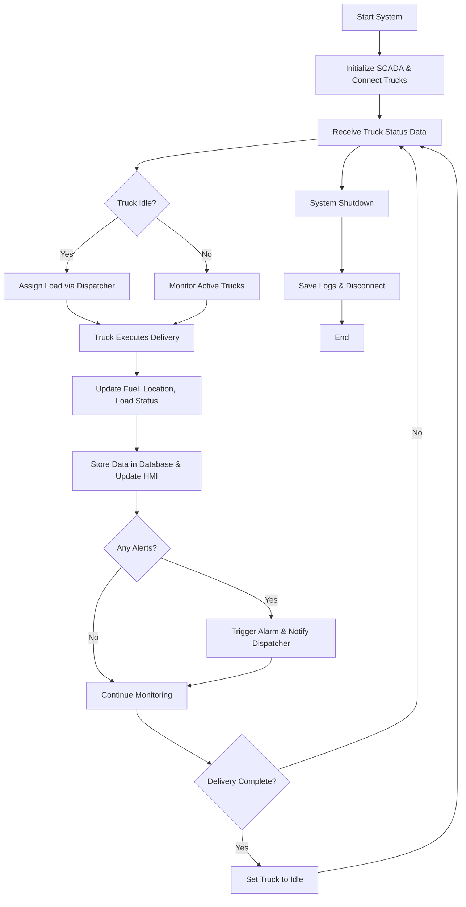

# TruckSimGroup16
In this project we will use c# for coding. we will be applying our knowledge of TDD along with integration testing. we will also be developing a proper SRS and Flow chart diagrams for the project as well. 

Mini SDLC Due frifday October 17, 2025
Team Member assignments

1. Create a Github Repository            - ~~Devki~~
2. Finalize Team Charter                 - Devki (waiting on Nasir and Shreemn to sign the contract)
3. Create a project pitch                - ~~Devki~~
4. create a project plan                 - ~~Shumroz~~
5. write up the Requirments document     - ~~Devki~~
6. Product Description                   - ~~Devki~~
7. Product Diagram                       - Shumroz
  a. Flow Chart
  b. UML
  c. Class Diagram
  d. Sequence Diagram
8. Product Backlog                       - Shumroz
9. User Story Acceptence Criteria        - Shumroz
10. Risk Register                        - Nasir
11. Test Plans                           - Nasir
      a. Unit integration testing
      b. System testing
      c. Usability testing 

